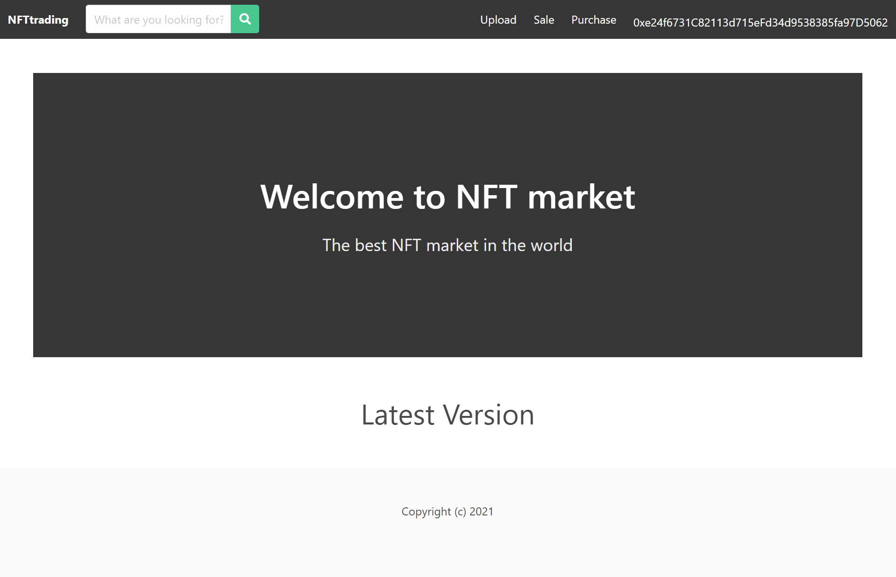

# NFTtrading-Platform

### 使用说明

1. `git clone https://github.com/TTXS123OK/NFTtrading-Platform.git`
2. `cd NFTtrading-Platform`
3. `truffle compile`

4. 将 `build\contracts\NFTtrading.json` 替换`platform\src\api\NFTtrading.json`

5. 打开`ganache`，选择`quickstart`，进入设置 `add project` 导入 `truffle-config.js` 点击`save and restart`

6. `truffle migrate`

7. 打开`chrome`浏览器，在`metamask`添加`ganache`中的虚拟账户

8. `cd platform`

9. `npm install bulma`

10. `npm install --save web3`

11. `npm run serve`

12. 浏览器中打开`localhost:8080`

13. 运行成功截图
 
